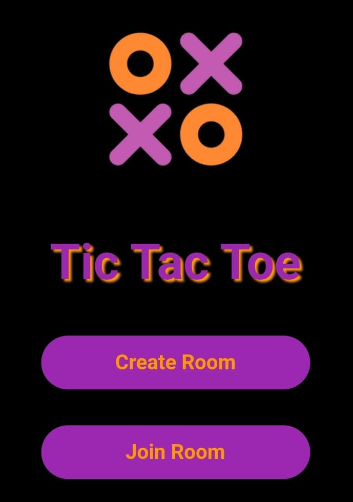

# Networking-Multiplayer-Tic-Tac-Toe

A multiplayer Tic Tac Toe Game embedded With Socket.io Networking

## Features
- Create/Join Room
- Play Realtime
- Display Points
- Round & Game Winner

<p align="center">
    
</p>

## Installation
After cloning this repository, migrate to ```flutter-multiplayer-tictactoe``` folder.

Install dependencies (Client Side)
```bash
flutter pub get
```

Install dependencies (Server Side)

```bash
cd server && npm install
```

Start the server

```bash
npm run dev
```

## Tech Used
Node.js, Express, Socket.io, Mongoose, MongoDB

Flutter, Provider

## Networking 

- Application Layer - HTTP
- Transport Layer - TCP with interface- Socket
- Network Layer - IP
